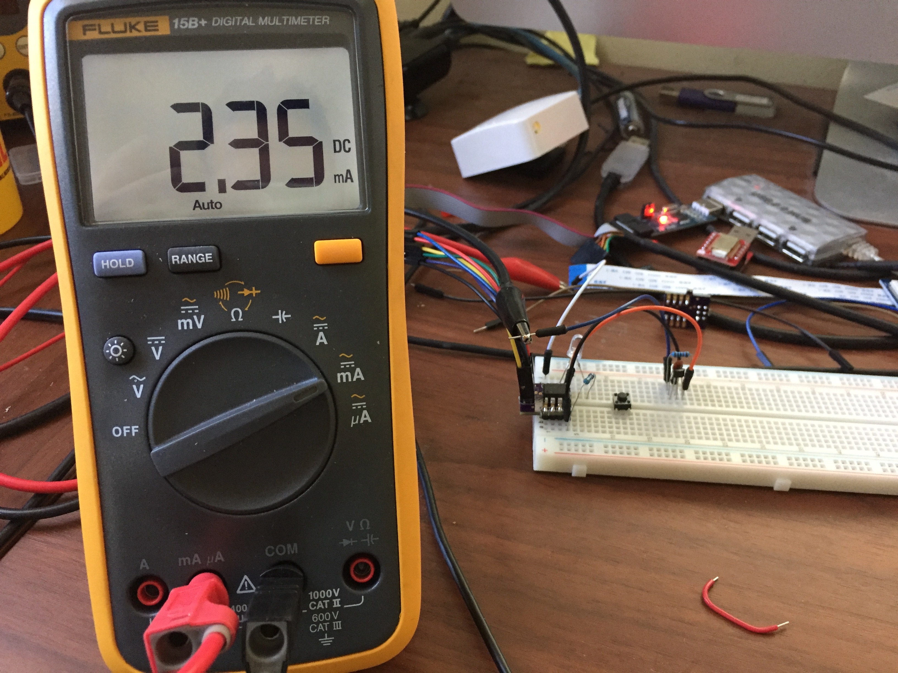

# ATTiny85 w/DRV5033 omnipolar hall effect sensor

### Description

Measuring the current consumption of the DRV5033 at 3.3V.  With magnet: 2.62mA, without magnet: 2.35mA

Active High (no magnet):

Low (magnet):

